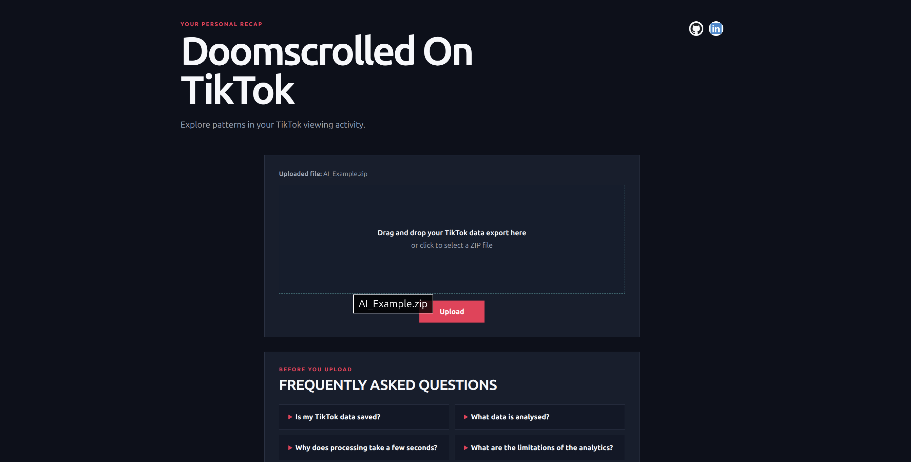
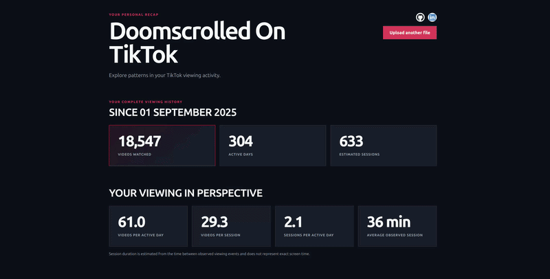

# TikTok Personal Analytics Platform

This is a Flask-based web application that processes a User's exported Tiktok data and presents anayltics about their viewing and login history through a dashboard. The application takes a Tiktok data export as a ZIP archive, extracts relevant activity data, processes, and generates statistics and visualations describing the user's usage.

This project focuses on learning how to design a data-processing pipeline and secure handling of sensitive user-uploaded data. Additionally, this project was a practical way to learn how to build an end-to-end data processing workflow.

Compatibility Note: The application has been developed and tested using TikTok data exports generated in English. Exports generated using other languages may use different field or section names and are not currently supported

### Upload Page



## Why am I building it?

This project was inspired by sites such as Wasted on LoL, where a user enters their username and is shown statistics based on their League of Legends activity.

I wanted to build a similar experience for TikTok. After spending a lot of time scrolling, I was curious about how much time I had actually spent on the platform and what patterns could be found in my usage.

The aim is to present that data in a more interesting and visually appealing way, while also using the project to improve my skills in Python, Flask, Pandas, data-processing, backend development, and data visualisation.


## Tech Stack

- **Python** - Backend development and data processing
- **Flask** - Web application framework
- **Pandas** - Data processing and analytics
- **Matplotlib** - Data visualisation
- **HTML / CSS / JavaScript** - Frontend

## Features

### Analytics Dashboard



### Data Processing

- Accepts TikTok data exports as ZIP archives
- Validates uploaded files before processing
- Locates and parses the required JSON data
- Processes watch history and login history
- Converts activity records into Pandas DataFrames
- Cleans and prepares timestamp data for analysis

### Viewing Analytics

The application calculates statistics including:

- Total videos watched
- Number of active days
- Average videos watched per active day
- Daily, weekly, and monthly activity
- Most active viewing hour
- Most active weekday

### Session Analytics

- Number of estimated sessions
- Average videos watched per session
- Average estimated session duration
- Longest estimated session
- Average sessions per active day

### Login Analytics

Login history is also processed to provide statistics such as:

- Total logins
- Average logins per active day
- Daily login activity
- Most active login hour
- Most active login weekday


```text
TikTok ZIP Export
    └──► Validate Upload
              └──► Parse JSON
                        └──► Process with Pandas
                                  └──► Generate Analytics
                                            └──► Display Dashboard
```


## Running Locally

### 1. Clone the repository

```bash
git clone https://github.com/kevinsiu-cs/Tiktok-Personal-Analytics.git
cd Tiktok-Personal-Analytics
```

### 2. Create and activate a virtual environment

```bash
python -m venv .venv
source .venv/bin/activate
```

> **Ubuntu note:** If creating the virtual environment fails, you may need to install the optional `python3-venv` package.


### 3. Install dependencies

```bash
pip install -r requirements.txt
```

### 4. Run the application

```bash
flask run
```

## Disclaimer

> This project is an independent educational project and is not affiliated with, endorsed by, or associated with TikTok.
